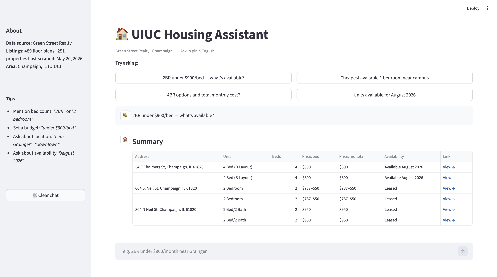

# 🏠 UIUC Housing Assistant

An AI-powered housing search tool for UIUC students. Ask in plain English — get real, ranked listings from Champaign landlords.

> *"2 bedroom under $900/bed near campus"* → instant results from Green Street Realty, with prices, availability, and direct links.

## What It Does

Most UIUC students search for housing on Apartments.com or Craigslist, where listings are often stale, mis-priced, or already rented. This tool goes directly to the source — scraping major Champaign landlords — and lets students search using natural language instead of filters.

Built as an original portfolio project to demonstrate production-ready AI engineering skills: RAG pipeline design, local LLM integration, web scraping, and full-stack deployment.

## Demo

Streamlit chat UI — ask a question, get a comparison table with address, unit type, price range, availability, and a direct link.*




## Architecture — How RAG + LangChain Work

The system runs in two phases: **Build** (run once to index listings) and **Query** (runs on every student question).

### Phase 1 — Build the Knowledge Base (`ingest.py`)

```
┌─────────────────────────────────────────────────────────────────┐
│                        DATA PIPELINE                            │
└─────────────────────────────────────────────────────────────────┘

  Green Street          normalize_           ingest.py
  Realty website  ───►  green_street.py ───► (LangChain)
  (Playwright           raw JSON ──►
   scraper)             SQLite DB
                          │
                          │  sqlite3.connect()
                          ▼
                   ┌─────────────┐
                   │  SQLite DB  │   489 listings
                   │  listings   │   (address, beds,
                   │  table      │    price, url…)
                   └──────┬──────┘
                          │
                          │  LangChain Document()
                          ▼
                   ┌─────────────────────────────┐
                   │  LangChain Documents         │
                   │                             │
                   │  page_content: "2BR apt at  │
                   │  503 E White St, $875/bed…" │
                   │                             │
                   │  metadata: {beds:2,          │
                   │   price_low:875, url:…}      │
                   └──────────────┬──────────────┘
                                  │
                                  │  HuggingFaceEmbeddings
                                  │  all-MiniLM-L6-v2
                                  ▼
                   ┌────────────────────────────────────┐
                   │  Embedding Model                   │
                   │                                    │
                   │  "2BR apt at 503 E White…"         │
                   │        │                           │
                   │        ▼                           │
                   │  [0.23, -0.41, 0.87, …] vector     │  ← 384-dim 
                   │  (numerical "meaning" fingerprint) │
                   └──────────────┬─────────────────────┘
                                  │
                                  │  Chroma.from_documents()
                                  ▼
                   ┌─────────────────────────────┐
                   │       chroma_db/            │
                   │   (Chroma Vector Store)     │
                   │                             │
                   │   doc_1 → [0.23,-0.41,…]    │
                   │   doc_2 → [0.11, 0.67,…]    │
                   │   doc_3 → [-0.05,0.33,…]    │
                   │      … 489 vectors …        │
                   └─────────────────────────────┘
                        persisted to disk ✅
```

### Phase 2 — Answer a Student's Question (`rag_chain.py` + `app.py`)

```
┌─────────────────────────────────────────────────────────────────┐
│                        QUERY PIPELINE                           │
│                  (LangChain LCEL chain)                         │
└─────────────────────────────────────────────────────────────────┘

  Student types in Streamlit UI (app.py)
  ───────────────────────────────────────
  "2BR under $900/bed — what's available?"
          │
          │  chain.invoke(question)
          ▼
  ┌──────────────────────────────────────────────────────────┐
  │  STEP 1 — Embed the question (same model as ingest)      │
  │                                                          │
  │  "2BR under $900/bed…"  ──►  [0.19, -0.38, 0.91, …]      │
  └───────────────────────────────────┬──────────────────────┘
                                      │
                                      ▼
  ┌──────────────────────────────────────────────────────────┐
  │  STEP 2 — Vector similarity search in Chroma (k=6)       │
  │                                                          │
  │  Query vector vs. all 489 stored vectors                 │
  │                                                          │
  │   doc_47  similarity: 0.94  ◄── best match               │
  │   doc_112 similarity: 0.91                               │
  │   doc_203 similarity: 0.88                               │
  │   doc_8   similarity: 0.85                               │
  │   doc_301 similarity: 0.83                               │
  │   doc_77  similarity: 0.79                               │
  │                                                          │
  │  → Returns top 6 LangChain Document objects              │
  └───────────────────────────────────┬──────────────────────┘
                                      │  retriever.invoke()
                                      │  also used by app.py
                                      │  to build the table
                                      ▼
  ┌──────────────────────────────────────────────────────────┐
  │  STEP 3 — Format docs into plain text (format_docs)      │
  │                                                          │
  │  "503 E White St · 2BR · $875/bed · Available…           │
  │   ---                                                    │
  │   601 S 6th St · 2BR · $860/bed · Leased…                │
  │   ---  …"                                                │
  └───────────────────────────────────┬──────────────────────┘
                                      │
                                      ▼
  ┌──────────────────────────────────────────────────────────┐
  │  STEP 4 — Fill the PromptTemplate                        │
  │                                                          │
  │  "You are a UIUC housing assistant…                      │
  │                                                          │
  │   LISTINGS:                                              │
  │   {context}  ◄── the 6 retrieved docs go here            │
  │                                                          │
  │   STUDENT QUESTION:                                      │
  │   {question} ◄── the original query goes here            │
  │                                                          │
  │   INSTRUCTIONS: …format as 📍🛏💰📅…"                     │
  └───────────────────────────────────┬──────────────────────┘
                                      │
                                      ▼
  ┌──────────────────────────────────────────────────────────┐
  │  STEP 5 — Local LLM generates the answer (ChatOllama)    │
  │                                                          │
  │   llama3.1:8b running via Ollama                         │
  │   (no internet, no API cost)                             │
  │                                                          │
  │  Input:  filled prompt (listings + question)             │
  │  Output: formatted markdown response                     │
  └───────────────────────────────────┬──────────────────────┘
                                      │
                                      ▼
  ┌──────────────────────────────────────────────────────────┐
  │  STEP 6 — StrOutputParser                                │
  │                                                          │
  │  Strips the LLM message object → plain Python string     │
  └───────────────────────────────────┬──────────────────────┘
                                      │
                                      ▼
  ┌──────────────────────────────────────────────────────────┐
  │  app.py renders two things in the chat UI                │
  │                                                          │
  │  ┌─────────────────────┐  ┌──────────────────────────┐   │
  │  │  Comparison Table   │  │   LLM Answer (chat)      │   │
  │  │  (from retriever)   │  │   (from chain)           │   │
  │  │                     │  │                          │   │
  │  │  Address | Beds |   │  │  📍 503 E White St       │   │
  │  │  Price   | Avail│   │  │  🛏 2BR · $875/bed       │   │
  │  │  ────────┼──────│   │  │  💰 $1,750/mo total      │   │
  │  │  503 E W.│  2   │   │  │  📅 Available Aug 2026   │   |
  │  │  …       │  …   │   │  │  …                       │   │
  │  └─────────────────────┘  └──────────────────────────┘   │
  └──────────────────────────────────────────────────────────┘
```

## Tech Stack

| Layer | Technology |
|---|---|
| **LLM** | Ollama · `llama3.1:8b` (local, no API cost) |
| **RAG framework** | LangChain + Chroma vector store |
| **Embeddings** | `all-MiniLM-L6-v2` via `sentence-transformers` |
| **Scraping** | Playwright (headless Chromium) |
| **Database** | SQLite |
| **Frontend** | Streamlit |
| **Language** | Python 3.14 |


## Project Structure

```bash
ai/
├── scrapers/
│   └── green_street.py         # Playwright scraper → green_street_raw.json
├── normalize_green_street.py   # Cleans raw JSON → SQLite
├── ingest.py                   # Embeds listings into Chroma vector store
├── rag_chain.py                # Retriever + LLM chain
├── app.py                      # Streamlit chat UI
├── green_street_raw.json       # Raw scraped data (489 floor plans)
├── green_street_listings.db    # Normalized SQLite database
├── chroma_db/                  # Persisted vector store
└── design_docs/                # Research notes and phase docs
```


## Setup

### 1. Clone and create a virtual environment

```bash
git clone <your-repo-url>
cd uiuc-housing-assistant-langchain-rag
python3 -m venv .venv 
source .venv/bin/activate
```

### 2. Install dependencies

```bash
pip install langchain langchain-ollama langchain-community langchain-core \
            chromadb sentence-transformers streamlit \
            playwright pandas sqlite-utils python-dotenv
playwright install chromium
```

### 3. Install and start Ollama

```bash
brew install ollama
brew services start ollama
ollama pull llama3.1:8b
```


## Running the Pipeline

Run these once to build the data layer, then launch the app.

```bash
# Step 1 — Scrape Green Street Realty
python scrapers/green_street.py
# → green_street_raw.json  (489 floor plans · 251 properties)

# Step 2 — Normalize and store in SQLite
python normalize_green_street.py
# → green_street_listings.db

# Step 3 — Embed listings into Chroma
python ingest.py
# → chroma_db/  (first run downloads ~90 MB embedding model)

# Step 4 — Launch the app
streamlit run app.py
# → http://localhost:8501
```


## Data Sources

| Company | Status | Method |
|---|---|---|
| **Green Street Realty** | ✅ Live | Playwright scraper |
| Universities Group | 🔜 Planned | Playwright scraper |
| MHM Properties | 🔜 Planned | Playwright scraper |
| Here 707 | 🔜 Planned | TBD |
| Hub on Campus | 🔜 Planned | TBD |

All scrapers respect each site's `robots.txt` and `Crawl-delay` directive.


## Roadmap

- [ ] Add Universities Group scraper
- [ ] Add MHM Properties scraper
- [ ] Weekly auto-refresh scheduler (`refresh.py`)
- [ ] Deploy to Railway with OpenAI API swap
- [ ] Distance-to-campus filter
- [ ] Saved searches / favorites


## Acknowledgements

Learning path inspired by [瓦子's guide on Xiaohongshu](https://www.xiaohongshu.com/explore/69c9a6400000000023021345) on breaking into AI engineering roles. 